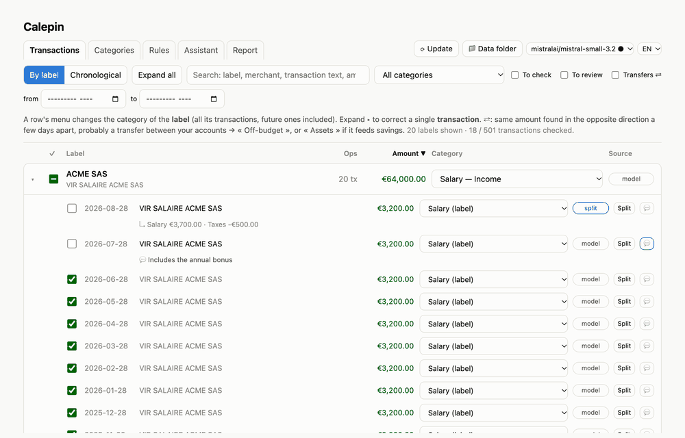
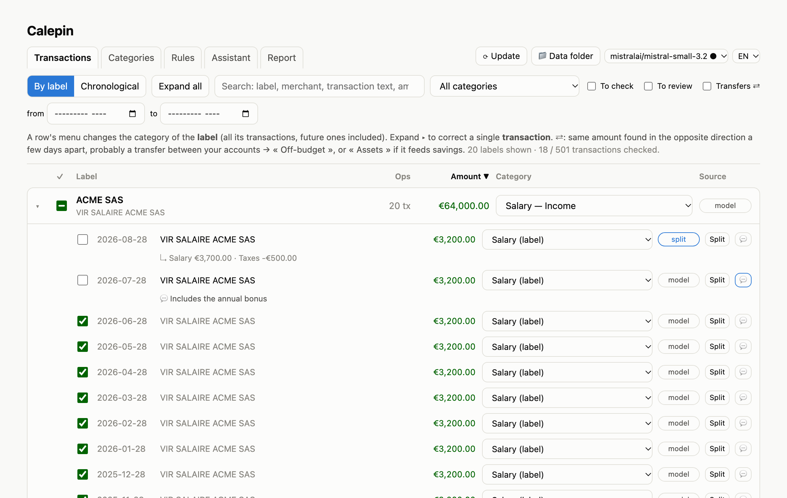
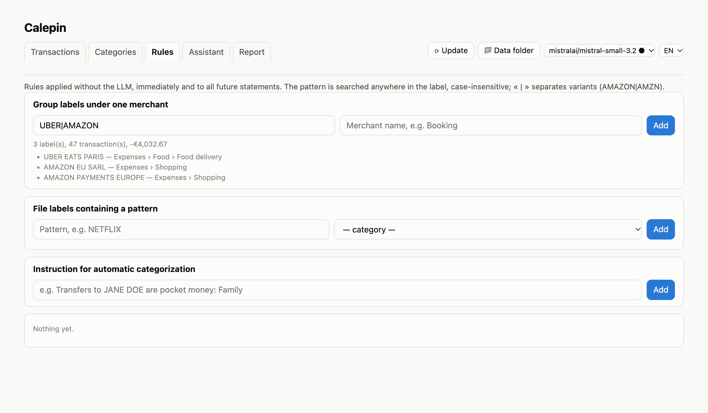
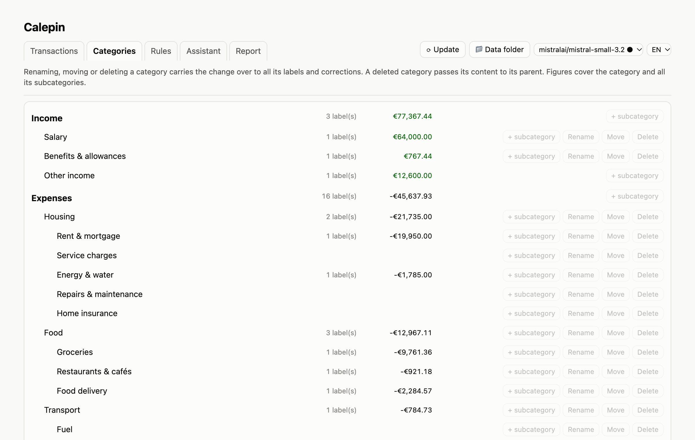
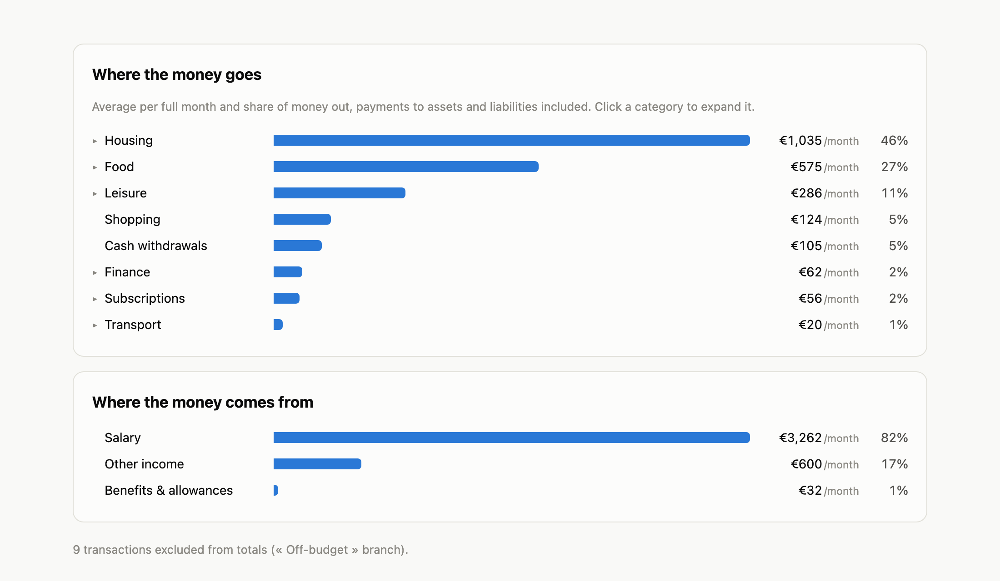
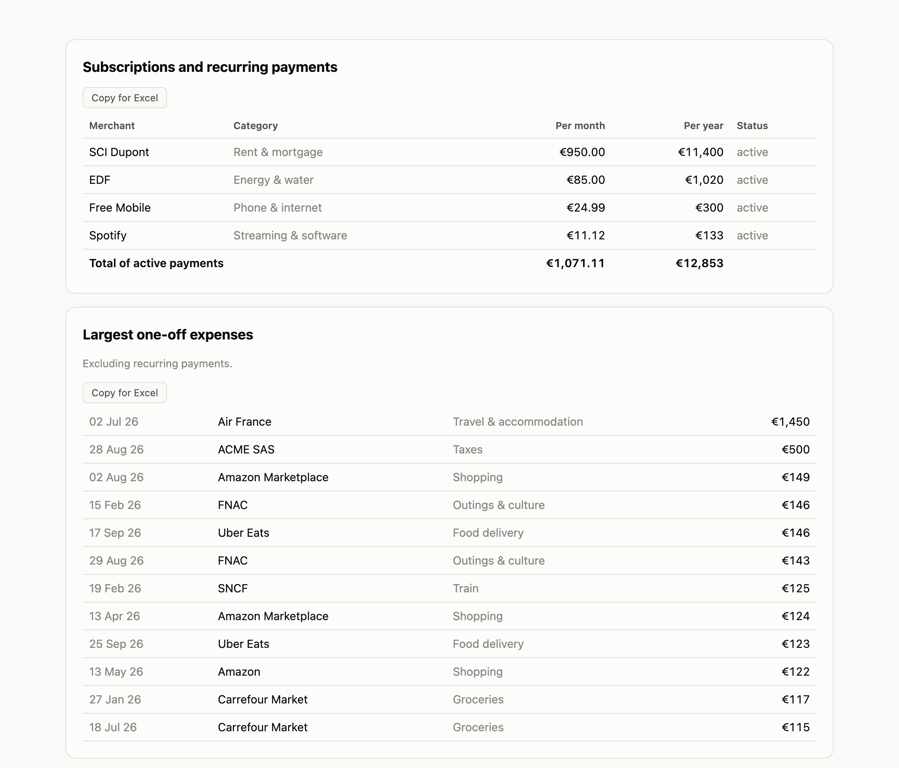
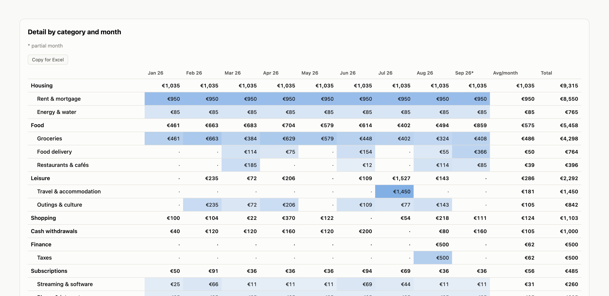

# Calepin

*[Version française](README.fr.md)*

**Your bank statements, categorized and charted by an AI that never leaves your computer.**

**[▶ Try the online demo](https://calepin-app.github.io/Calepin/)**: the real app running in your browser on made-up
statements, with the local LLM's answers recorded in advance. **[⬇ Install it](#install)**: no coding needed.

Drop your CSV exports in a folder. A local LLM works out each bank's format, files every transaction
into your own category tree, and you get a clean report of where your money goes. No cloud, no
account, no bank connection: the model runs on your machine (LM Studio, with the model of your choice) and your
data stays in a folder you choose.

<p align="center"></p>

A small personal tool, written almost entirely by an AI (Claude) under my direction, that I find
genuinely handy for my own accounts. No big promises: it works on my Mac with my banks' exports.
Issues and suggestions are welcome, especially from Windows and Linux users.

### Highlights

- 🔒 **Private by design**: nothing leaves the machine, not even to an AI provider.
- 🧠 **Reads any bank's CSV**: the LLM maps unknown formats (even multi-line labels) once, then Python
  takes over. Overlapping exports and several accounts are de-duplicated correctly.
- 🗂️ **Your categories, GnuCash style**: an unlimited tree, plus Assets / Liabilities to track savings
  and loans apart from day-to-day spending.
- ✅ **Review fast**: tick transactions as checked, split a salary between pay and tax, comment,
  rename merchants, group label variants. Every correction is remembered for future statements.
- 💬 **Talk to it**: tell the assistant « AMAZON and AMZN are the same shop » and apply what it proposes.
- 📊 **Report you can use**: flows by category, expandable trees, recurring payments, month-by-month
  table, any period, PDF export, one-click copy to Excel, optional written analysis.
- 🌍 **English or French**, switchable in one click.

## Screenshots

**Review transactions**: by label or chronologically, with checks, splits and comments.

<p align="center"></p>

<table>
<tr>
<td width="50%"><b>Rules without the LLM</b>: the labels a pattern catches show while you type.<br></td>
<td width="50%"><b>Category tree</b>: add, rename, move or delete; corrections follow.<br></td>
</tr>
<tr>
<td><b>Where the money goes / comes from</b><br></td>
<td><b>Recurring payments and largest expenses</b><br></td>
</tr>
</table>

**Month-by-month detail**, ready to copy into Excel.

<p align="center"></p>

<sub>Screenshots use generated fake statements.</sub>

## How it works

| Task | Done by |
|---|---|
| Reading CSVs, removing duplicates, every computation | Python (deterministic) |
| Understanding an unknown CSV format, categorizing labels, writing the analysis | Local LLM |

The LLM does **no arithmetic**: every figure in the report comes from Python.

**Language**: English or French, chosen in the page (FR / EN selector, top right); by default the
macOS language. It applies to the page, the report, the console and the LLM prompts. The category
tree can use English roots (Income, Expenses…) or French ones (Revenus, Dépenses…); on first launch
`categories.example.txt` or `categories.exemple.txt` is copied, depending on the language.

## Install

No programming needed: three free downloads, about 15 minutes (mostly waiting for the model).

**1. LM Studio, the app that runs the AI on your computer.**
Download it from [lmstudio.ai](https://lmstudio.ai), install it and open it once. In its
**Discover** tab (magnifying glass), search for `mistral small 3.2` and download it (~13.5 GB;
best with 24 GB of memory or more). On a computer with 16 GB, pick a smaller model instead
(7 to 8 billion parameters): faster, but it makes more mistakes. You can leave LM Studio closed
afterwards; Calepin starts it when needed.

**2. Python, the language Calepin is written in.**
- **macOS**: usually nothing to do. If Python is missing, the first launch of Calepin makes macOS offer
  to install its « command line developer tools » (free, from Apple): accept, then open the launcher
  again. Alternatively, install Python from [python.org](https://www.python.org/downloads/).
- **Windows**: download the installer from [python.org](https://www.python.org/downloads/), and tick **« Add python.exe to PATH »** on the installer's first screen.
- **Linux**: usually already installed (`python3 --version` should print 3.9 or later).

**3. Calepin.**
Download **`Calepin-….zip`** from the [latest release](https://github.com/Calepin-app/Calepin/releases/latest), unzip it where you like (for
example in Documents), then open the launcher:

| System | Launcher |
|---|---|
| macOS | double-click **`Calepin.command`** |
| Windows | double-click **`Calepin.bat`** |
| Linux | run **`./calepin.sh`** |

The first time on macOS, the system may refuse to open a file downloaded from the internet: open
**System Settings → Privacy & Security**, scroll down and click **Open Anyway** (on older macOS:
right-click the launcher → Open). On Windows, SmartScreen may show « Windows protected your PC »:
click **More info → Run anyway**.

Calepin opens in your browser. Start with **📁 Data folder → Try with sample statements**, click
**⟳ Update**, and explore. When you are ready, point 📁 Data folder at a folder of your own and put
your banks' CSV exports in its `data/` subfolder.

<details><summary>More about models and requirements</summary>

- Any chat model that follows instructions and supports structured output works; developed with
  `mistralai/mistral-small-3.2` (MLX build on Apple Silicon, GGUF elsewhere; a GPU helps a lot on
  Windows/Linux).
- If several models are installed, pick one in the model list at the top of the page (● = loaded in
  memory); with a single model, or a single loaded one, Calepin uses it. `BANQUE_LLM_MODEL` forces a
  model (e.g. for `run.py` in a scheduler).
- Calepin starts the LM Studio server (`lms server start`) if needed; the model loads on the first
  request and unloads after 1 h of inactivity.
- Python 3.9+, standard library only: nothing else to install.
- **Updating**: download the new zip and unzip it over the old folder (or into a new one, then move
  `.banque.json` and, if you kept it there, the `private/` data folder across). Your statements and
  corrections live in the data folder, never in Calepin's own files.
- Developers can also `git clone` the repository instead of downloading the zip.

</details>

Developed and tested on an Apple Silicon Mac; the Windows and Linux launchers are provided but have
not been tested yet.

## Usage

Start Calepin with the launcher for your system; it opens the page in your browser (or reopens it if
Calepin is already running). The terminal window runs the app: close it, or Ctrl+C, to stop it.

**Try it first with made-up statements**: 📁 Data folder → **Try with sample statements** creates
`~/Calepin demo` with a few fictitious exports (two formats, two accounts), then click ⟳ Update.
Point 📁 Data folder back to your own folder when you are done.

1. Put your bank CSV exports in the `data/` folder of the data folder (`./private/data` by default;
   **📁 Data folder** shows or changes it). Several banks, several formats and overlapping statements
   are all fine.
2. Click **⟳ Update** in the page: imports new statements and has the LLM categorize new labels; the
   progress shows in the page.
3. Check and correct in the page, then open the **Report** tab: computed on the fly for the chosen
   period (from / to, remembered), without the LLM. **LLM analysis** inserts findings and ideas at the
   top of the report (1 to 4 min). **Export to PDF** opens printing (choose « Save as PDF »): A4,
   sections kept whole, charts and tables scaled to the page width.

Command line (same on every system): `python3 pipeline/revue.py` (the app),
`python3 pipeline/run.py --import` (import only), `python3 pipeline/run.py --open` (import + report).

| Option of `run.py` | Effect |
|---|---|
| `--import` | import and categorization only, no report |
| `--open` | opens the report at the end |
| `--commentaire` | adds the analysis written by the LLM (slow) |
| `--du=2025-01` / `--au=2025-12` | limits the report to a period (month, or day: `2025-01-15`) |

First run: about 20 min (every label goes through the LLM). Afterwards only new merchants are sent
to the model.

## The page

A local page on `127.0.0.1:8765` only. In its header: **⟳ Update** (import new statements),
**📁 Data folder** (show or change it), the LLM model list and the **FR / EN** language selector.

**Transactions**
- grouped **by label** (« Expand all » button) or **chronological**; click a column header to sort
  (again to reverse; categories sort in tree order), remembered per view;
- a row's menu changes the category of the **label**: all its transactions, future ones included;
  ▸ expands a label to correct a single **transaction**;
- **✎** renames a merchant; **Split** spreads one transaction over several categories (e.g. a salary:
  Salary +3,500, Taxes −600, Expenses refunded +100; the first line takes the remainder);
  **💬** adds a comment (searchable);
- **check boxes**: ticking a transaction confirms its category; a label's box ticks all its
  transactions. A check is dropped automatically if the category changes later;
- filters: search (label, merchant, transaction text, amount, date), category, **To check**,
  **To review**, **Transfers ⇄** (same amount in the opposite direction within 5 days: probably a
  transfer between your own accounts), period.

**Categories**: add, rename, move, delete, with every label and correction following along.

**Rules**: without the LLM, group label variants under one merchant (`AMAZON|AMZN` → Amazon), file
every label containing a pattern into a category, or add an instruction for automatic
categorization. Matching labels show while you type.

**Assistant**: describe what is wrong in plain language; the local LLM proposes actions (group,
categorize, create a category, remember an instruction), each with a preview and an Apply button.
1 to 3 min per answer on an Apple Silicon Mac.

Priority: corrected transaction > corrected label > pattern rules > LLM. Manual corrections are never
overwritten.

## Categories

The tree lives in `<data folder>/travail/categories.txt`, GnuCash style: two spaces of indentation =
one level, any depth.

```
Expenses
  Housing
    Energy & water
```

- Required roots: **Income**, **Expenses**, **Off-budget** (excluded from totals: transfers between
  your own current accounts, credit card statement payments).
- Optional roots: **Assets** and **Liabilities**, for flows that build or reduce net worth (savings,
  property, loans). They are outside the budget, appear as cash flows in « Where the money goes / comes
  from », and have their own « Net worth » section.
- Each node adds up its whole subtree. A refund goes to the expense it refunds and reduces it.
- « Miscellaneous » and « Other income » (or « Divers » / « Autres revenus ») are fallback categories
  and cannot be renamed or deleted.
- No `:` in names (it separates paths).

## Report

- Income, expenses, balance, payments to assets and liabilities: monthly averages over full months,
  or totals for the period
- Flows by category: monthly bars, income up and expenses down, categories stacked (largest nearest
  the axis), monthly and cumulative balance; adjustable threshold, below which categories go to
  « Other »; optional separate display of large subcategories
- Where the money goes / comes from: expandable trees
- Net worth, subscriptions and recurring payments (active or stopped, price changes, totals),
  last month's increases, largest one-off expenses, category × month table
- « Copy for Excel » button on every table (amounts pasted as numbers)

## Data folder

Everything personal lives in one folder: `data/` (raw statements) and `travail/` (everything derived:
formats, categories, corrections, checks, comments, report, logs). `./private` by default, excluded
from git. To put it elsewhere (a backed-up or synced folder), move it whole, then click **📁 Data
folder** in the page and pick it (Browse… or paste the path); Calepin restarts on it. The choice is
stored in `.banque.json`
(local, excluded from git, along with the language).

## Under the hood

**Formats.** For a CSV never seen before, the LLM reads the first 25 lines and returns a map of the
format: header line, separator, date / label / amount (or debit + credit) columns, decimal comma.
Python validates it by parsing the whole file (≥ 90 % of lines read), then remembers it. Multi-line
labels (Crédit Agricole) are handled.

**Signs.** Negative amount = money out. For single-amount formats where purchases are positive
(Amex), the majority sign is taken as the expense sign.

**Duplicates.** Statements of the same format are first grouped by account: two files come from the
same account if they share most transactions of their common period. Within an account, a
transaction counts as many times as it appears at most in a single file: overlapping exports create
no duplicates, two identical coffees on the same day stay two coffees. Across accounts, transactions
add up.

**Categorization.** Labels are normalized (dates, references, numbers removed), then sent in batches
of 40 to the LLM, with the direction (debit / credit) but no amount. The answer is constrained by a
JSON schema that only allows the paths of `categories.txt`.

**Recurring payments.** Same merchant over ≥ 3 months, median gap of 24 to 38 days, amount stable
from month to month (a price change is tolerated). Active if seen in the last 45 days.

## Privacy

- Nothing leaves the machine: no external resource, no network call except to the local LM Studio.
- The console only shows file names and counts. An unexpected error only shows its type and code
  line; the full trace (which may contain data) goes to `travail/derniere_erreur.log`.
- Formats are named `n°1`, `n°2`…: no name taken from the files is displayed.
- This project was built with Claude Code, which never accessed the data folder: deny rules in
  `.claude/settings.json` (and `.claude/settings.local.json` for a relocated folder), and all
  development on generated fake statements.

## Troubleshooting

| Message | What to do |
|---|---|
| `LM Studio server unreachable` | open LM Studio, or `~/.lmstudio/bin/lms server start` |
| `LM Studio answered HTTP 404` | the chosen model is no longer installed: pick another one in the page |
| `… models installed in LM Studio: choose …` | pick a model in the list at the top of the page |
| `Unrecognized format for <file>` | the LLM could not read that format |
| `The known format can no longer read <file>` | the bank changed its export: delete its entry in `travail/formats.json` |
| `Statements folder not found` | the data folder moved: the page opens the 📁 Data folder panel, pick it |
| `statement(s) in a format not recognized yet` | click ⟳ Update: the LLM learns the new format |
| macOS refuses to open `Calepin.command` | right-click → Open → confirm |
| Windows: nothing happens | install Python from python.org (tick « Add to PATH ») |

## Automation (optional)

To import automatically on a schedule or when files arrive, run `python3 pipeline/run.py --import`
from your system's scheduler (launchd or cron on macOS/Linux, Task Scheduler on Windows). Example
with launchd on macOS, importing whenever a file lands in `data/` (adapt the paths):

```sh
cat > ~/Library/LaunchAgents/com.calepin.import.plist <<PLIST
<?xml version="1.0" encoding="UTF-8"?>
<!DOCTYPE plist PUBLIC "-//Apple//DTD PLIST 1.0//EN" "http://www.apple.com/DTDs/PropertyList-1.0.dtd">
<plist version="1.0"><dict>
  <key>Label</key><string>com.calepin.import</string>
  <key>ProgramArguments</key><array><string>/usr/bin/env</string><string>python3</string>
    <string>$HOME/vsCode/banque/pipeline/run.py</string><string>--import</string></array>
  <key>WatchPaths</key><array><string>$HOME/vsCode/banque/private/data</string></array>
  <key>ThrottleInterval</key><integer>30</integer>
</dict></plist>
PLIST
launchctl bootstrap gui/$(id -u) ~/Library/LaunchAgents/com.calepin.import.plist
```

Uninstall: `launchctl bootout gui/$(id -u)/com.calepin.import && rm ~/Library/LaunchAgents/com.calepin.import.plist`

## License

Copyright 2026 The Calepin authors. Licensed under the [Apache License 2.0](LICENSE).
